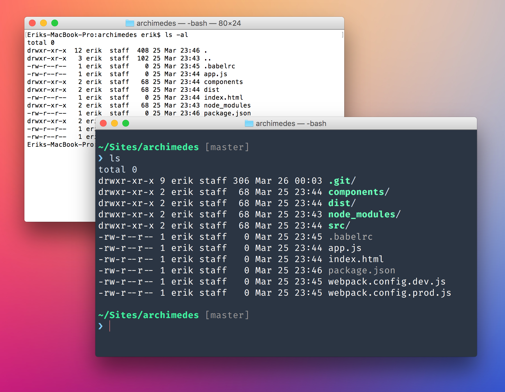

# Dotfiles
First, I’d like to point out that _I have no idea what I’m doing_ ™, but after two reinstalls using this stuff most of it actually work like a charm.

This repo came about when I realized that I dreaded doing full reinstalls of my Mac because of the sheer amount of initial config required to get it up to speed. It is my attempt at keeping as much configuration/setup as possible versioned and available when I need it, hopefully making clean reinstalls a breeze 👌. It will:

* Tweak Bash (with a new theme, new font ([Fira Code](https://github.com/tonsky/FiraCode)), some aliases etc.).
* Setup Homebrew and install a number of [formulaes and casks](https://github.com/epavletic/dotfiles/blob/master/Brewfile).
* Setup [NVM](https://github.com/creationix/nvm) and with it, download Node & NPM.
* Install a bunch of global NPM packages.
* Setup MacOS with a [bunch of nice defaults](https://github.com/epavletic/dotfiles/blob/master/_bootstrap/setup-osx.sh).
* Install settings, keybindings and extensions for Visual Studio Code.

This is basically what you’ll be looking at when done:

Most of it is obviously tailored to my needs/preferences, but feel free to poke around. I’ve also written a [post mortem](https://github.com/epavletic/dotfiles/wiki/Post-mortem-of-a-clean-install-of-MacOS) with some notes from using the dotfiles. Mostly for me, but maybe you’ll find something interresting in there as well.

## Great story man, so how does this work?

1. First, make sure you’ve installed Xcode and the Xcode Command Line Tools: Just download Xcode from the Mac App Store and then run `$ xcode-select --install` in the terminal. After you´ve done this you propably need to launch Xcode once to accept the terms of the Xcode software license agreement.
2. Make sure you’re in your Home-directory (just type `cd` silly), and run `git clone git@github.com:epavletic/dotfiles.git .dotfiles`.
3. The `_bootstrap`-folder is where most of the work is done. There’s a setup-*.sh-file for each of the main ingredients – I’d suggest going at them from top to bottom (bash → homebrew → node → macos → vscode). If you’re feeling adventurous there’s a badass `_bootstrap.sh` that will plow through each of them in order, but frankly, I haven’t taken it for a spin (yet).

## ToDo’s
- [ ] Add Webstorm/IntelliJ configuration files to repo.

## Shoutouts
- [Dan Eden](https://daneden.me/) whos sweet [dotfiles-repo](https://github.com/daneden/dotfiles) inspired me to get my shit together and create my own.
- [Mathias Bynens](https://mathiasbynens.be) and his awesome list of [MacOS Defaults](https://mths.be/macos).
